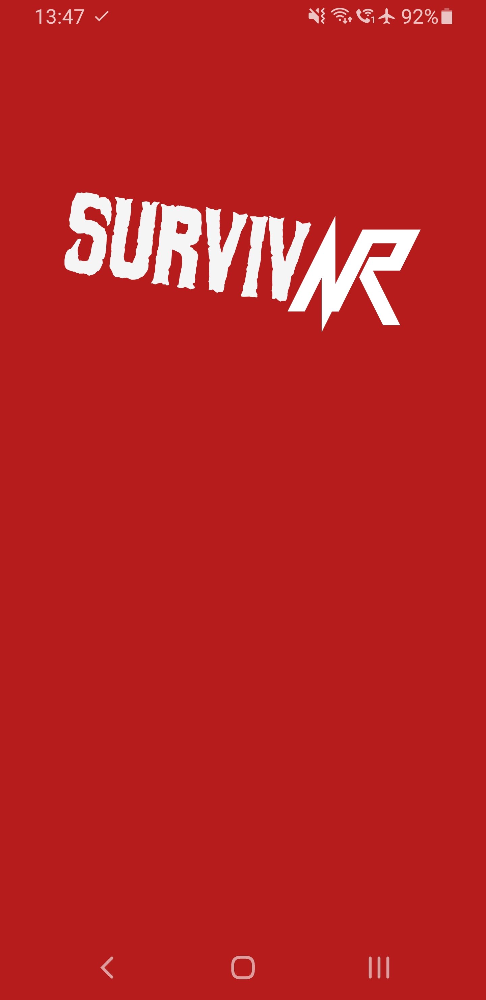
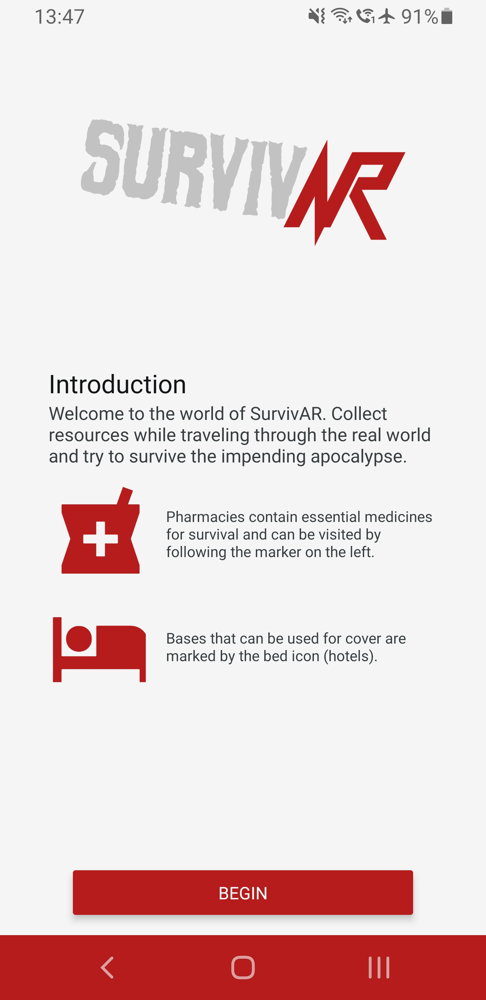

<!--  -->

# SurvivAr
A concept augmented reality app about fighting in a zombie apocalypse, based on Geolocation.
Sourcing data from the Google Places API, this app directs the user to visit pharmacies and
hotels in order to complete "survival" tasks.

Hotels allow the user to "rest", by waiting a certain amount of time within reach of the hotel.
Pharmacies allow the user to "scavenge" for resources, by displaying a map with waypoints on 
which the user can find products and scan their QR code (thereby "obtaining" them).
Also, the app features a background service which can run while the phone is on standby and point
him, with a notification, towards the right direction.
This background service was heavily optimized and runs on native code, ensuring the app will not
drain any battery life, even if it tracks the user for hours.

By combining the above mechanics with a narrative structure and cooperating with local businesses to create waypoints treasure hunts or other publicity events could be organized.
Furthermore, the app can easily be reskinned to remove the zombie theme and change it to
say, a pirate theme.

## Tech Stack
This app is written in Typescript and based on the React Native framework.
It combines Redux, React, and redux Sagas in order to form the Model, View, and controller
of an MVC architecture.
Redux sagas handles the business logic of the app, communicating with the native code,
fetching data from APIs, and allowing the app to have a linear flow of complex logic without needing a backend service.
Apart from the Places API, the app acts completely independently without needing a backend server.
It can easily be expanded to include more complex and sequential tasks for the user, by
handling more complex logic easily.

### Location
In addition, this contains a background service which would be impossible to create 
in React Native.
This service was written using native code and uses the Fused Location Provider in Google APIs
in order to track the location of the user in both foreground and background without using
a lot of battery life.

It does this by using the following assumption: if the user is X away from the closest target, then it will take him at least Y to reach it.
Therefore, we can wait at least Y before rechecking his location.
Furthermore, if Y and X are large enough, we can instruct the API
to geofence the user (create a barrier around him and notify us when he leaves it).
That way we can completely stop location checks and battery drain if, say, he sits in a table.
The fused location provider will then monitor the user using an accelerometer, which is very
battery efficient.

Sounds simple, but since the above code acts independently of React (JS doesn't run
in the background), and it depends on knowing and acting on the Points of Interest of the user, it wasn't as simple as setting a bunch of callbacks on the Google APIs.
A part of the model had to be ported to native code and the redux Sagas have to parcel and pass the user's points to it when the app closes to the native code.
Then, the native code uses its own business logic to decide when the user is close to a point of
interest and enters it.
It saves all the progress the user completes in the background (to the second) and when the 
app returns to the foreground it passes it to React.
It also persists its data itself before passing it on.
That way, if the OS garbage collects our service, the user's progress is preserved and the 
background service can be woken up on its own again without invoking any JS code.

## UI Overview
### Intro
When the app loads it presents a gorgeous full screen splash screen with the logo properly sized.
Part of it had to be written in native XML because React Native didn't (maybe still doesn't) have built
in splash screens.

Then, the user is presented with a short introduction to the App and prompted to accept a location permission.
The background feature works regardless of whether he chooses "Allow all the time" or "Allow only while using
the app" because it was created as a foreground service.
That's also really important since both Google and Apple are cracking down in background location fetching
and the location features are crippled otherwise (running as a background and not foreground service).
Sadly, that also means that the service has to be started while the app is running, so the user has to initiate it.
But for the use case of this App it is acceptable.

  

### Main Interface
The main interface of the app opens up a beautiful full screen Google Maps instance,
spanning all the way to the top,
which is skinned to match the theme of the app.
Below, there is a horizontal scrolling list listing the objectives of the user by distance.
When the user enters within the specified distance a timer starts.

On the right, there are four buttons that give access to three zoom levels (closest point, closest three points
and all points), activate the compass to rotate the map depending on the position of the phone, and to activate
the background service, which is opt in.

(Ignore the joystick and blue circle, it is the GPS Joystick app used for testing = I didn't have to run around)

  

### Pharmacies (QR Waypoint) Screen
When the user is within distance of a pharmacy he is presented with an "Open" 
option.
When he enters the interface he sees a map of the building, here some schematics from google,
displaying the items he has to scan (random selection from ./qr directory).
When he finds an item he can click the bottom of the screen to swap the map with a camera
instance and scan it.
The item will become green in the list below and in the map.
After he finishes he will go back to the main screen, which he can also go to by pressing back
as well.
(the form of the back button changes based on the android device, here it is a right swipe).

  

### Background Service Notifications
If the user clicks the background service button, he will turn on the background service.
Then, when he leaves the app it will start and display a custom notification which will track
his progress and inform him of the direction and distance of the closest point of interest.
If he believes the service isn't updating fast enough he can force an update by clicking the refresh button and if he wants to close it
he can click exit.

  

When he reenters the app, the progress he did while the app was in the background is displayed.

# How to run
I don't remember, but filling the `.env` file with your keys, running
`npm ci` to install dependencies and then `npx react-native run-android` to
compile and push to your phone (which has turned on USB debugging and is connected to USB)/emulator should work.

# License
I haven't decided about the license yet but feel free to run the app, look at the code, 
and contact me for more information.